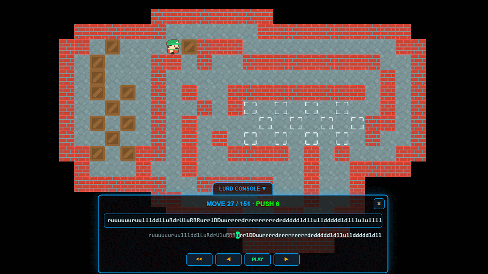

# Crate Escape

Crate Escape is a Sokoban-style puzzle game built for web and installable offline play. Optimised for desktop, tablet, and mobile, it lets you push crates across classic level collections, track your progress, plan and step through solutions with LURD controls, and design/share playable custom levels.

## Live Play

[Play Crate Escape](https://www.korovatron.co.uk/crate_escape/)

## Features

- Includes complete **Microban**, **Sasquatch**, **Magic Pearls**, and **Grigr** level collections (**2001**, **2002**, **Challenge**, **Comet**, **Special**, **Star**, **Sun**).
- **Grigr** level sets are included with direct author permission (Evgeniy Grigoriev, 2026-03-01).
- Optimised for **desktop**, **tablet**, and **mobile**.
- Full input support for **keyboard/mouse** and **touch** controls.
- Installable as a **PWA** with **offline support**.
- Save level progress, best stats, and solutions locally.
- Optional **cloud sync** to keep progress and stats available across devices.
- Built-in **custom level importer** and **graphical level designer**.
- **LURD console** with plan, step-through, replay, and share workflow.
- Create and share **fully playable custom levels via URL links**.

## Gameplay Highlights

- Track best moves and pushes per level.
- Plan, step through, replay, and share solutions with LURD controls.
- Fast reset/undo/redo workflow for puzzle iteration.

## Licence

This repository is released under the [Crate Escape Non-Commercial Attribution Licence (CE-NCAL) v1.0](LICENSE.md).

- Non-commercial use, modification, and sharing are allowed.
- Attribution to Neil Kendall is required.
- Commercial use requires prior written permission.
- Third-party content remains under its own terms as listed in [THIRD_PARTY_NOTICES.md](THIRD_PARTY_NOTICES.md).

